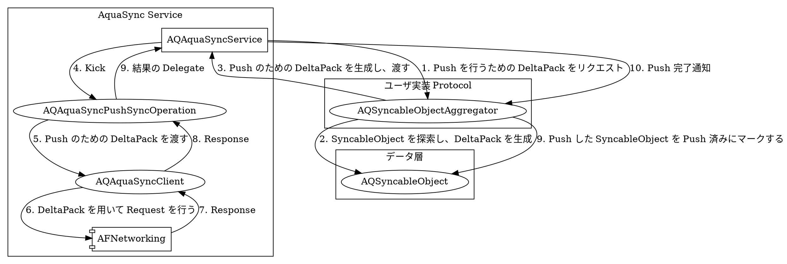

```graphviz
digraph G {
	subgraph cluster_protocol {
		label = "ユーザ実装 Protocol"

		AQSyncableObjectAggregator
	}
	AQAquaSyncService -> AQSyncableObjectAggregator [label = "1. Push を行うための DeltaPack をリクエスト"]
	AQSyncableObjectAggregator -> AQSyncableObject [label = "2. SyncableObject を探索し、DeltaPack を生成"]
	AQSyncableObjectAggregator -> AQAquaSyncService [label = "3. Push のための DeltaPack を生成し、渡す"]

	subgraph cluster_0 {
		label = "AquaSync Service"

		AQAquaSyncService [shape = box]
		AQAquaSyncPushSyncOperation
		AQAquaSyncClient
		AFNetworking [shape = component]
	}
	AQAquaSyncService -> AQAquaSyncPushSyncOperation [label = "4. Kick"]
	AQAquaSyncPushSyncOperation -> AQAquaSyncClient [label = "5. Push のための DeltaPack を渡す"]
	AQAquaSyncClient -> AFNetworking [label = "6. DeltaPack を用いて Request を行う"]
	AFNetworking -> AQAquaSyncClient [label = "7. Response"]
	AQAquaSyncClient -> AQAquaSyncPushSyncOperation [label = "8. Response"]
	AQAquaSyncPushSyncOperation -> AQAquaSyncService [label = "9. 結果の Delegate"]
	AQAquaSyncService -> AQSyncableObjectAggregator [label = "10. Push 完了通知"]

	subgraph cluster_data {
		label = "データ層"

		AQSyncableObject
	}
	AQSyncableObjectAggregator -> AQSyncableObject [label = "9. Push した SyncableObject を Push 済みにマークする"]
}
```